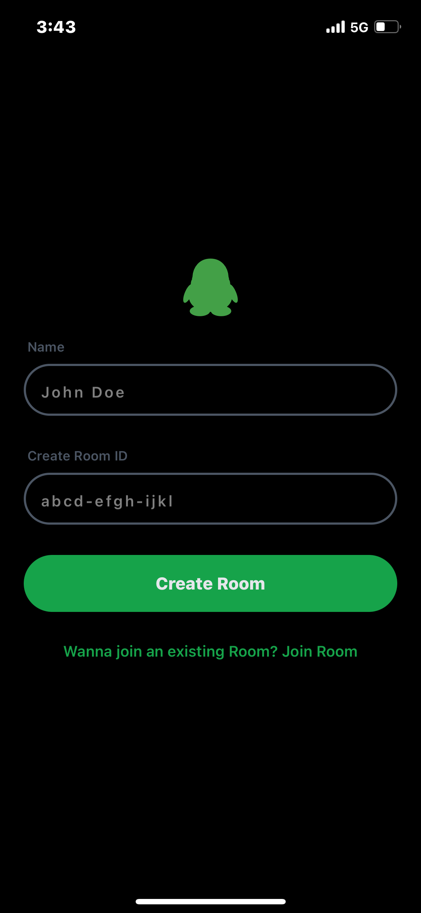
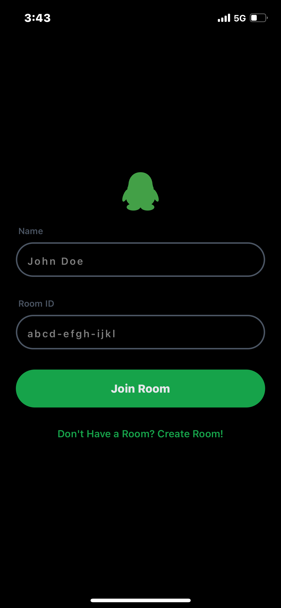
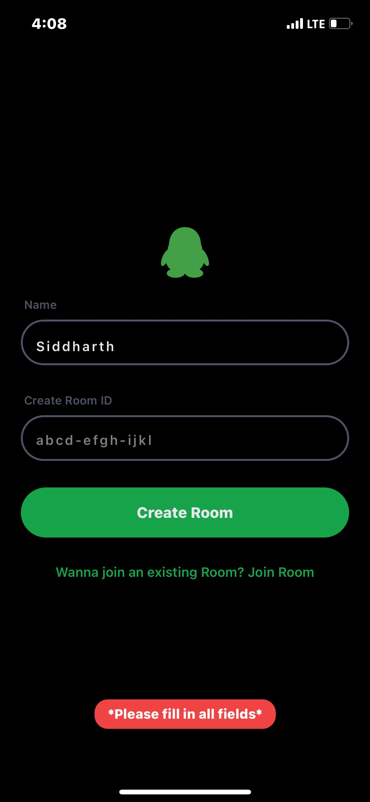

# Temu Discord

A real-time chat application built with React Native, Expo, and TypeScript featuring room-based messaging.

## Features

### Room Management
- Create or join chat rooms with custom Room ID (6-9 characters)
- User name input for identification
- Form validation with toast notifications
- Toggle between Create/Join modes

### Chat Interface
- Real-time message display with user avatars
- Message bubbles (left-aligned for others, right-aligned for current user)
- Multi-line text input with auto-expanding height
- File attachment button
- Leave room functionality

### Toast Notifications
- Success and error toast messages
- Animated fade-in/fade-out effects
- 5-second auto-dismiss

## Tech Stack

- React Native
- Expo
- TypeScript
- NativeWind (Tailwind CSS)
- Expo Router
- @expo/vector-icons

## Components

- `JoinRoom` - Room creation/joining screen
- `ChatPage` - Main chat interface
- `Messages` - Message list display
- `ToastProvider` - Global toast notifications

## To Be Implemented

- WebSocket integration for real-time messaging From: [Backend Repo](https://github.com/woustachemax/temu-discord)
- Message persistence
- File attachment functionality
- Typing indicators
- Read receipts